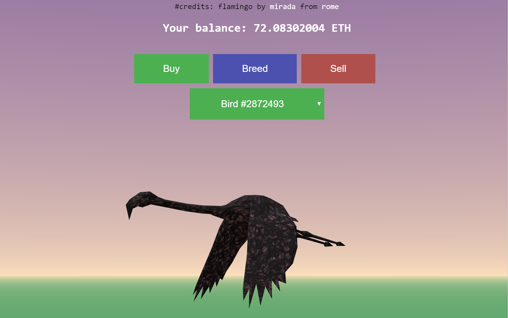

# Crypto Birds



## Useful links

We use [Truffle](http://truffleframework.com/) to compile, test and deploy smart contracts.

You can use [this faucet](https://gitter.im/kovan-testnet/faucet) to get some Kovan ethers.

[ERC721](https://github.com/OpenZeppelin/openzeppelin-solidity/tree/master/contracts/token/ERC721) contracts by OpenZeppelin

You may potentially face [this issue](https://github.com/trufflesuite/truffle/issues/734#issuecomment-358528186)

## Get started
1. Install [Yarn](https://yarnpkg.com/lang/en/docs/install/)
2. `yarn install` - installs all dependencies
3. `yarn build` - builds contracts.
4. `yarn ganache` - runs ganache (a local test ethereum network).
5. `yarn test` - runs tests
6. `yarn migrate --reset` - deploys contracts
7. `yarn serve` - serves frontend

# Truffle console
```
token = CryptoBirds.at('0x263f5d9ecc94405b6ba056afe2c9ef8424caf818');
token.balanceOf.call(me).then(function(balance) { console.log(balance.toNumber()) });
token.buy({value: 10e18});
```

## Authors
Powered by Alex Bash @ Zerion
